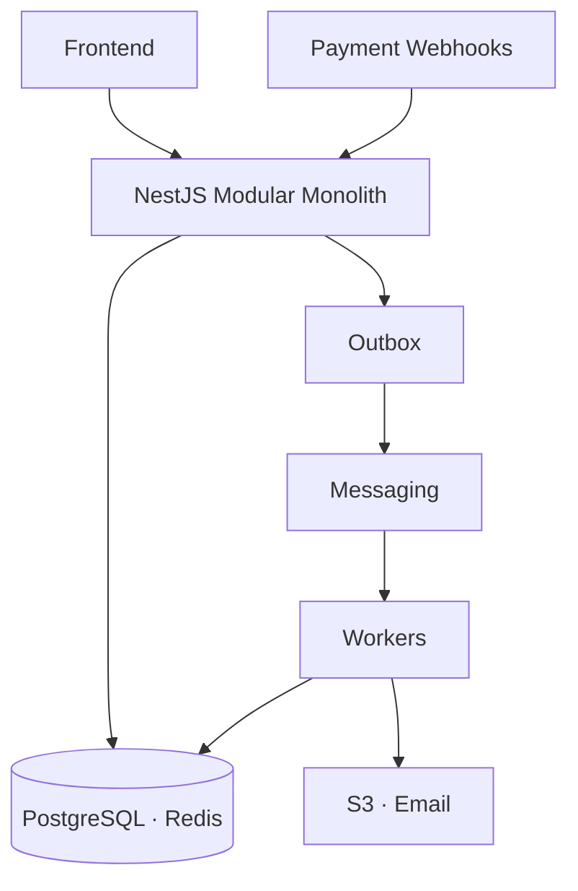
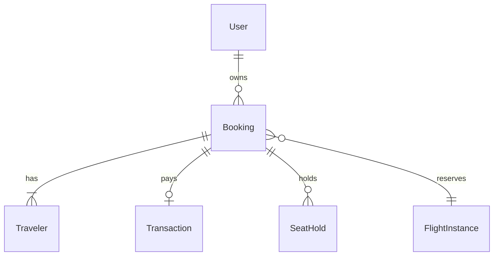

# MaxAirline Backend

Backend for a flight booking platform built as a **NestJS modular monolith** — flight search, pricing, PNR lifecycle, seat inventory, payments (Stripe / YooKassa), and asynchronous PDF ticketing.

**Related:** [Frontend](https://github.com/KLIFF1218/flights-booking-frontend) · [Live Demo](https://maxairline.xyz)

---

## Overview

MaxAirline models an OTA-style flow: **search → price → PNR → travelers → seats → payment → ticket email**. Schedules, fares, and seat maps are stored in **PostgreSQL** (internal inventory, no GDS).

The implementation focuses on problems that show up in real backends: **DB transactions and locking**, **cache TTL boundaries**, **idempotent webhooks**, **at-least-once async handoff**, and **observability hooks** — without claiming load-test numbers or full production hardening.

---

## Backend Highlights

- NestJS modular monolith with separated domain modules and shared `infra/`
- PostgreSQL transactions, inventory reservation, and advisory locks at checkout
- Redis caching with TTL aligned to booking lifecycle; `Booking.snapshot` fallback
- Transactional Outbox for reliable event publishing (Kafka, RabbitMQ, internal topics)
- Idempotent Stripe / YooKassa webhooks with replay-safe processing
- Asynchronous ticketing via RabbitMQ handoff and BullMQ workers
- JWT access tokens with refresh rotation, hashing, and replay detection
- Cursor-based flight search pagination
- Structured logging, Prometheus metrics, and health checks
- Docker Compose dev stack and GitHub Actions CI/CD to GHCR + VPS

---

## Architecture



| Layer             | Responsibility                                                   |
| ----------------- | ---------------------------------------------------------------- |
| **API**           | Versioned REST (`/api/v1`), validation, rate limiting, Swagger   |
| **Domain**        | `flights`, `bookings`, `payment`, `ticketing`, `auth`, `admin`   |
| **Data**          | Prisma/PostgreSQL; Redis for cache, rate limits, scheduler locks |
| **Async**         | Outbox processor → RabbitMQ / Kafka; BullMQ for PDF and mail     |
| **Observability** | Pino logs, `/metrics`, `/health/ready`; optional Sentry & OTLP   |

Access JWT (~15m, Bearer) is validated via Passport without a refresh-token DB lookup on each request. Refresh tokens live in HttpOnly cookies, hashed in PostgreSQL, rotated on use. CSRF on cookie-authenticated mutations.

---

## Booking & Payment Flow

```mermaid
flowchart LR
  S[Search] --> P[Pricing]
  P --> B[Booking + snapshot]
  B --> T[Travelers]
  T --> H[Seat holds]
  H --> C[Checkout]
  C --> PP[Stripe / YooKassa]
  PP --> WH[Webhook]
  WH --> OB[Outbox]
  OB --> RMQ[RabbitMQ]
  RMQ --> BQ[BullMQ]
  BQ --> PDF[Ticket PDF]
  PDF --> S3[S3]
  S3 --> EM[Email]
```



| Step                  | Mechanisms                                                                                            |
| --------------------- | ----------------------------------------------------------------------------------------------------- |
| **Booking**           | DB transaction, inventory reserve, `Booking.snapshot`, Redis TTL extend, outbox `booking.created`     |
| **Travelers / seats** | `Traveler` rows; `SeatHold` until `booking.expiresAt` (30 min)                                        |
| **Checkout**          | `pg_advisory_lock`, pricing quote validation → `PAYMENT_PENDING`                                      |
| **Webhook**           | Stripe signature / YooKassa IP check; `IdempotencyOperation` → `PAID`                                 |
| **Ticketing**         | Outbox → RabbitMQ `booking.paid` → BullMQ `issue-ticket` (retries, `jobId` dedup) → S3 → `mail` queue |

Status: `PNR_CREATED` → `SEATS_SELECTED` → `PAYMENT_PENDING` → `PAID` → `TICKETING` → `TICKETED`

---

## Key Backend Features

- **Snapshot fallback** — `BookingSnapshotOfferService` reads `Booking.snapshot` when Redis search cache expired (`bookingId` on pricing/seatmap).
- **Seat holds** — capacity reserved at PNR create; scheduler expires stale bookings and releases holds/inventory.
- **Idempotent PNR create** — `Idempotency-Key` header → `BookingIdempotencyRecord`.
- **Rate limiting** — Redis-backed presets per route (`RateLimitGuard`).

---

## Messaging Architecture

### BullMQ

Background jobs with retries and backoff: `ticketing` (`issue-ticket`) and `mail`. Keeps Puppeteer PDF generation and S3 uploads off the HTTP thread.

### RabbitMQ

Application-level handoff after payment: outbox publishes to exchange `booking.events` (routing key `booking.paid`) → `BookingEventsConsumer` enqueues BullMQ ticketing.

### Kafka

Domain event stream when `KAFKA_BROKERS` is configured (Redpanda in dev Docker Compose). Outbox publishes topics such as `booking.created`, `booking.paid`, `ticket.issued`. Consumers project into `DomainEvent` (audit), `UserNotification`, and `BookingAnalyticsDaily`.

**Production caveat:** `docker-compose.production.yml` includes RabbitMQ but not Kafka or MinIO — configure external S3 and optionally Kafka; consumers log warnings if the broker is unreachable.

### Why not one messaging system?

Each layer solves a different boundary:

- **Outbox** — atomicity with PostgreSQL (same transaction as booking/payment state).
- **RabbitMQ** — decouple the API/webhook process from ticketing enqueue (topic routing, separate consumer).
- **BullMQ** — job retries, backoff, and long-running work on Redis (already used for cache).
- **Kafka** — append-only domain events for audit and read-side projections (notifications, analytics), not for ticketing job execution.

This is intentional separation, not three systems doing the same job. The trade-off is a larger operational surface and more infrastructure to maintain.

---

## Tech Stack

**Core** — Node.js 22 · TypeScript · NestJS 11 · PostgreSQL · Prisma

**Infrastructure** — Redis · Docker · RabbitMQ · Kafka (dev) · BullMQ

**Integrations** — Stripe · YooKassa · S3/MinIO · Resend · VK OAuth · Puppeteer

**Observability** — Pino · Prometheus · Grafana · Sentry & OTLP (optional)

**Testing** — Jest · Supertest · Testcontainers

---

## API

Base: `http://localhost:3001/api/v1` (paths below are relative to this base)

| Method | Endpoint                     | Description                    |
| ------ | ---------------------------- | ------------------------------ |
| `POST` | `/auth/login`                | Login                          |
| `POST` | `/auth/refresh`              | Rotate refresh token           |
| `POST` | `/flights/search`            | Start search                   |
| `GET`  | `/flights/search/:searchId`  | Results (cursor)               |
| `POST` | `/flight/pricing`            | Price offer                    |
| `POST` | `/seatmaps/by-offer`         | Seat map                       |
| `POST` | `/booking`                   | Create PNR (`Idempotency-Key`) |
| `POST` | `/booking/:id/travelers`     | Confirm travelers              |
| `POST` | `/booking/:id/seats/confirm` | Checkout → payment URL         |
| `POST` | `/webhook/stripe`            | Stripe webhook                 |
| `POST` | `/webhook/yookassa`          | YooKassa webhook               |

**Outside `/api/v1`:** `GET /health/ready`, `GET /metrics`, Swagger at `/docs` when `SWAGGER_ENABLED=true`.

---

## Data Model

`User` · `Booking` (+ `snapshot` JSON) · `Traveler` · `SeatHold` · `Transaction` · `Ticket` · `FlightInstance` / `FlightFare` / `FlightSeat` · `OutboxMessage` · `DomainEvent`



---

## Important Technical Decisions

### Why modular monolith?

**Problem** — Multiple bounded contexts, single deployable unit.  
**Solution** — NestJS modules + `infra/`; async boundaries via outbox and queues.  
**Why** — Shared DB transactions for booking and inventory.  
**Trade-off** — Independent scaling later requires extracting along existing queue APIs.

### Why Redis + booking snapshot?

**Problem** — Search cache TTL (15 min) ≠ PNR TTL (30 min).  
**Solution** — Redis for offers/pricing; snapshot on create; TTL extend; snapshot fallback.  
**Why** — Reduces repeated DB reads during search without breaking mid-checkout repricing.  
**Trade-off** — After PNR create, snapshot is the source of truth when cache is gone.

### Why transactional outbox?

**Problem** — Publishing to a broker inside a DB transaction fails if the broker is down.  
**Solution** — `OutboxMessage` in the same transaction; cron processor with retries.  
**Why** — At-least-once delivery with idempotent consumers (`DomainEvent.idempotencyKey`, BullMQ `jobId`).  
**Trade-off** — Notifications and analytics are eventually consistent.

### Why advisory locks?

**Problem** — Concurrent checkout requests for the same booking.  
**Solution** — `pg_advisory_lock` per booking ID during checkout (`booking-checkout-lock.util.ts`).  
**Why** — Transaction-scoped serialization without long row locks.  
**Trade-off** — Lock is connection-scoped; must stay inside the checkout transaction path.

### Why async ticketing?

**Problem** — PDF generation and email exceed webhook timeout budgets.  
**Solution** — Outbox → RabbitMQ → BullMQ with retry-based recovery.  
**Why** — Idempotent enqueue (`ticket-{bookingId}`) isolates failures from payment confirmation.  
**Trade-off** — RabbitMQ is required in production compose for the paid → ticket path.

### Why cursor pagination?

**Problem** — Offset pagination is unstable when the result set changes.  
**Solution** — Encoded cursor validated against `searchHash`; sort-aware (`CHEAPEST`, `FASTEST`, …).  
**Why** — Stable pages within one search session.  
**Trade-off** — Only flight search; user bookings use offset `page`/`limit`.

---

## Project Structure

```text
src/modules/     # domain (auth, flights, bookings, payment, …)
src/infra/       # redis, prisma, outbox, kafka, rabbitmq, s3, metrics
src/common/      # guards, filters, pipes, jwt strategy
prisma/          # schema + migrations
test/            # integration specs, e2e helpers
```

---

## Getting Started

Copy `.env.example` to `.env` and replace the placeholder values with your local credentials and secrets.

```bash
cp .env.example .env
```

### Option A — full stack in Docker (recommended)

App, migrations, and `start:dev` run inside the `app` container (see `scripts/docker-entrypoint.dev.sh`). Do **not** run `pnpm start:dev` on the host — port `3001` is already taken.

```bash
docker compose up -d --build
# optional demo data: set SEED_DEMO=true in .env, or:
# docker compose exec app pnpm seed:demo
```

### Option B — app on host, infra in Docker

```bash
docker compose up -d postgres redis rabbitmq minio minio-init redpanda
pnpm install
pnpm exec prisma generate
pnpm exec prisma migrate deploy
pnpm run seed:demo    # optional
pnpm run start:dev
```

**Local endpoints** (default `HTTP_PORT=3001`):

| URL | Notes |
| --- | --- |
| `http://localhost:3001/api/v1` | Versioned REST API |
| `http://localhost:3001/docs` | Swagger UI when `SWAGGER_ENABLED=true` |
| `http://localhost:3001/health/ready` | Readiness (outside `/api/v1`) |
| `http://localhost:3001/metrics` | Prometheus scrape target |

Option A also exposes Grafana (`http://localhost:3002`), Prometheus (`http://localhost:9090`), RabbitMQ management (`http://localhost:15672`), and MinIO console (`http://localhost:9001`) via dev Compose.

---

## Environment Variables

Copy [`.env.example`](.env.example) to `.env` and replace every `YOUR_*_HERE` placeholder (and empty payment keys) before starting.

**Validated by NestJS** (`src/config/env.schema.ts` at startup): `NODE_ENV`, `HTTP_PORT`, `HTTP_CORS`, `COOKIES_DOMAIN`, `DATABASE_URL`, `REDIS_URL`, `RABBITMQ_URI`, `RABBITMQ_EXCHANGE`, `RABBITMQ_QUEUE`, `RABBITMQ_DLX`, `S3_*`, `QUEUE_PREFIX`, `JWT_*`, `KAFKA_*`, `PAYMENT_PROVIDER_DEFAULT`, optional `STRIPE_*` / `YOOKASSA_*`, `RESEND_API_KEY`, `MAIL_FROM`, `APP_URL`, `VK_CLIENT_*`, `SWAGGER_*`, `METRICS_AUTH_TOKEN`, `SENTRY_DSN`, `OTEL_EXPORTER_OTLP_ENDPOINT`.

**Read by application code, not Zod:** `REDIS_HOST`, `REDIS_PORT`, `REDIS_PASSWORD` (Redis/BullMQ via `redis.config.ts`); `FX_*`, `FARE_TAX_*`, `BOOKING_SERVICE_FEE`, `MIN_*_TURNAROUND_MINUTES`; optional `NOTIFICATION_SSE_HEARTBEAT_MS`.

**Read by Sentry instrumentation** (`src/instrument.ts`, not Zod): `SENTRY_SEND_DEFAULT_PII`, `SENTRY_TRACES_SAMPLE_RATE`, `SENTRY_DEBUG`.

**Docker Compose only** (services / image tags — not NestJS connection settings): `POSTGRES_DB`, `POSTGRES_USER`, `POSTGRES_PASSWORD`, `RABBITMQ_USER`, `RABBITMQ_PASSWORD`, `MINIO_ROOT_*`, `GRAFANA_ADMIN_*`, `GITHUB_REPOSITORY`, `APP_VERSION`, `REDIS_MEMORY`, `SEED_DEMO`.

**Option B (app on host)** — active values in `.env.example` use `localhost` and exposed ports (`5433`, `6379`, `5672`, `9000`, `19092`). **Option A (app in Docker)** — `docker-compose.yml` overrides `DATABASE_URL`, `REDIS_HOST`, `REDIS_URL`, `RABBITMQ_URI`, `KAFKA_BROKERS`, and `S3_ENDPOINT` with Docker service hostnames (`postgres`, `redis`, `rabbitmq`, `redpanda`, `minio`).

**Production-only** (Zod `superRefine` when `NODE_ENV=production`): `JWT_ACCESS_SECRET` + `JWT_REFRESH_SECRET` (distinct), `METRICS_AUTH_TOKEN` (min 16 chars), `SWAGGER_ENABLED=false`, provider-specific `STRIPE_*` or `YOOKASSA_*`, `RESEND_API_KEY`.

---

## Testing

| Type                         | Command                 |
| ---------------------------- | ----------------------- |
| Unit (~160 specs)            | `pnpm test`             |
| E2E (11 suites)              | `pnpm test:e2e`         |
| Integration (Testcontainers) | `pnpm test:integration` |

Booking and payment services have the strongest unit coverage. End-to-end suites cover major modules; full booking → payment → ticketing integration is limited to one Testcontainers spec.

---

## Deployment

**CI** (`.github/workflows/ci.yml`) — on push/PR to `dev` / `master`: `pnpm install`, `prisma generate`, `pnpm lint`, `pnpm format:check`, `pnpm test`, `pnpm build`. On push to `master`: build and push Docker image to GHCR.

**CD** (`.github/workflows/cd.yml`) — after successful CI on `master`: SSH to VPS, `docker pull` GHCR image, then `docker compose -f docker-compose.production.yml up -d --pull always --remove-orphans` (migrations run via app entrypoint).

**Production services:** app, PostgreSQL, Redis, RabbitMQ, Prometheus, Grafana. External S3 expected; Kafka and MinIO not bundled in production compose.

---

## Performance / Scalability

Mechanisms implemented in code:

- **Redis caching** — search results, pricing quotes, seat maps; TTL extended to booking `expiresAt`
- **Cursor pagination** — flight search only
- **Database indexes** — e.g. `Booking(status, expiresAt)`, `FlightInstance(status, departureDate)`, idempotency uniques
- **Asynchronous processing** — ticketing and mail via BullMQ
- **Redis scheduler locks** — prevent duplicate cron work across instances
- **Rate limiting** — per-route Redis presets (search, auth, webhooks)

No load-test benchmarks are currently claimed.

---

## Engineering Challenges

### Search cache vs booking lifetime

**Problem** — Repricing failed after 15 min Redis TTL while PNR remained valid for 30 min.  
**Investigation** — Pricing/seatmap read Redis only; snapshot already stored at create.  
**Solution** — Extend Redis TTL on PNR create; `BookingSnapshotOfferService` fallback.  
**Result** — Mid-checkout repricing works without restarting search.

### Payment → ticketing consistency

**Problem** — Ticketing must run only after confirmed payment; webhooks may retry.  
**Investigation** — `IdempotencyOperation`, booking state machine, duplicate BullMQ jobs.  
**Solution** — Outbox → RabbitMQ → BullMQ with `jobId: ticket-{bookingId}`.  
**Result** — Webhook handler stays short; ticketing uses retry-based recovery in workers.

### Refresh token replay

**Problem** — Reuse of a rotated refresh token should signal compromise.  
**Investigation** — Token families per `UserDevice`; revoked rows keep `replacedBy` chain.  
**Solution** — `argon2` hash at rest, rotation on refresh, `REPLAY_ATTACK` revocation.  
**Result** — Access-token validation does not require a refresh-token database lookup on every request; replay is caught on refresh.

### FX / multi-currency checkout

**Problem** — Internal fares vs Stripe (USD/EUR) vs YooKassa (RUB).  
**Investigation** — Quotes store `fxRates`; checkout asserts price tolerance.  
**Solution** — FX sync to Redis; locked quote on pricing; provider currency guards.  
**Result** — Keeps seat-map and checkout totals aligned within the same quote window.

---

## Future Improvements

- Integration tests for the complete booking → payment → ticketing path
- Load testing (search cache hit ratio, checkout advisory-lock contention)
- Kafka in production compose or feature-flag optional consumers
- OpenTelemetry enabled by default in compose; rate-limit metrics dashboards
- Remove or implement dormant enums (`PaymentProvider.STARS`, unused OAuth providers)
- Wire `QUEUE_PREFIX` into BullMQ root config (env exists, not applied in `AppModule`)

---

## License

Private — `UNLICENSED` (see `package.json`).
