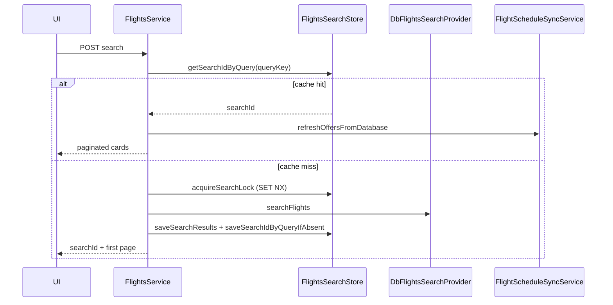

# Flights module

DB-backed flight search, indicative pricing quotes, FX conversion, and live schedule/inventory refresh. Not a GDS integration — offers are built from local `flight_instance` rows and simulator fare brands (LIGHT/FLEX).

## Layout

| Area | Service | HTTP |
|------|---------|------|
| Search | `FlightsService` + `DbFlightsSearchProvider` | `POST /flights/search`, `GET /flights/search/:searchId` |
| Pricing | `FlightsPricingService` + `DbPricingProvider` | `POST /flights/pricing` |
| Cache | `FlightsSearchStore` (Redis) | — |
| FX | `CurrencyRatesService` | refreshed hourly by `FxRatesSchedulerService` |
| Schedule sync | `FlightScheduleSyncService` | admin mutations + page reads |

Providers (DIP):

- `FLIGHT_SEARCH_PROVIDER` → `DbFlightsSearchProvider`
- `FLIGHT_PRICING_PROVIDER` → `DbPricingProvider`

Shared cross-module utilities (not owned by flights):

- `src/shared/booking/passenger-counts.util.ts` — max passengers, seat counts, infant rules
- `src/shared/pricing/pricing-quote.util.ts` — quote TTL, reprice errors (`QUOTE_EXPIRED`, etc.)

## Search flow

### Cache and lock

1. **Query key** — normalized directions, passengers, travel class, currency.
2. **Hit** — `flights:search:query:{hash}` → `searchId` → offers blob.
3. **Miss** — Redis lock `flights:search:lock:{hash}` (60s TTL).
4. **Peer wait** — if lock busy, poll up to 30s for peer's `searchId`.
5. **Double-checked read** — after lock, re-check cache before DB query.
6. **Empty search** — TTL 60s so new admin flights appear quickly.
7. **Race on mapping** — `saveSearchIdByQueryIfAbsent`; loser deletes orphan search blob.

### Pagination

- Cursor encodes sort key + `searchHash` (mismatch → 400).
- Filters applied in memory on preprocessed offers.
- **Live read** — `getSearchPage` calls `refreshOffersFromDatabase` (batch `findMany` instances) before sort/filter.

## Pricing flow

`DbPricingProvider.price` steps:

1. `loadOfferFromCache` — offer + search context from Redis
2. `loadFlightInstances` — batch Prisma load + bookability check
3. `resolvePassengers` — match search counts, optional last-pricing replay
4. `computeFareAndSeats` — fare totals + **batch** seat fees (`CalculateSeatPrice`)
5. `persistPricingQuote` — update offer in search cache, `saveLastPricing`, quote meta

### Quote and FX

| Concept | Detail |
|---------|--------|
| **Indicative** | Simulator fares from DB `fare` rows — not ticket stock |
| **Quote TTL** | 15 min default; 5 min when seats selected |
| **lockedFxRates** | Checkout passes snapshot — booking not affected by hourly FX refresh |
| **Reprice errors** | `QUOTE_EXPIRED`, `PRICE_CHANGED`, `QUOTE_MISMATCH` via `shared/pricing/pricing-quote.util` |
| **Process FX** | `CurrencyRatesService` → Redis + `setCurrencyRates()` global for search UI; checkout uses explicit rates in quote |

## Seat pricing (no N+1)

`CalculateSeatPrice` prefetches all selected seats with one `flightSeat.findMany` and active holds with one `seatHold.findMany`, then validates availability per segment.

## Schedule sync

| Event | Behavior |
|-------|----------|
| Instance **created** | `invalidateAllSearchCaches()` — new rows cannot be patched into old lists |
| Instance **updated** | `mutateCachedOffers` — patch segments; invalidate per-offer pricing |
| Page read | `refreshOffersFromDatabase` — drop unbookable offers; resync times/delays |

## Airport cache

`DbFlightsSearchProvider` caches airports in-memory with **5 minute TTL** (timezone lookups for local date windows).

## Testing

| Layer | Coverage |
|-------|----------|
| Unit | 27+ specs on utils, services, controllers |
| E2E | `flights.e2e-spec.ts` |
| Shared | `shared/pricing/pricing-quote.util.spec.ts` |

## Related modules

- **bookings** — consumes `FLIGHT_PRICING_PROVIDER`, `FlightsSearchStore`, pricing quote asserts
- **seatmaps** — offer from `FlightsSearchStore`; seat fees from `shared/pricing/seat-fee.catalog`
- **scheduler** — `FxRatesSchedulerService` refreshes rates hourly

## Known trade-offs (interview honesty)

- Connection search is in-memory pairing (capped at 500 offers per leg) — fine for pet scale.
- `FlightsSearchStore` also holds seatmap Redis keys — boundary with seatmaps module.
- Global `currencyRates` in `currency.util` for search display; bookings fix rates via quote.
- `convertCurrency()` without explicit rates uses process snapshot — prefer `convertCurrencyWithRates` in new code.
