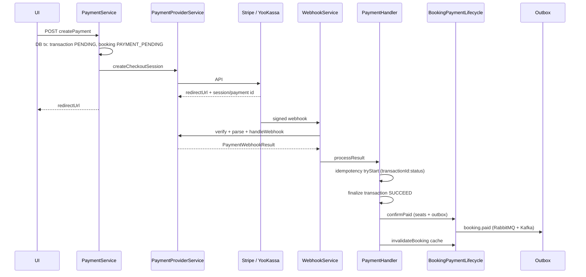

# Payment module

How checkout, webhooks, idempotency, capture/refund ordering, and outbox fit together.

## Principles

- **Webhook-first:** booking becomes `PAID` only after a signed provider webhook, not after browser redirect.
- **Registry (DIP):** `PaymentProviderService` routes all provider calls (checkout, capture, refund, webhook ingress) through `PaymentProviderRegistry` — webhook handlers do not import Stripe/YooKassa directly.
- **State machines:** `Transaction` (`PENDING` → `AUTHORIZED` → `SUCCEED` / `FAILED` / `CANCELED`) and `Booking` (`SEATS_SELECTED` → `PAYMENT_PENDING` → `PAID` / `CANCELED` / `EXPIRED`) are updated with conditional `updateMany` to stay safe under concurrency.

## Happy path: create → provider → webhook → outbox



### 1. `createPayment` (`PaymentService`)

1. Validates booking (`SEATS_SELECTED`, not expired).
2. In one DB transaction: upsert `Transaction` as `PENDING`, set booking `PAYMENT_PENDING`, optional `afterPaymentPending` hook.
3. **Outside** the transaction: call `PaymentProviderService.get()` → provider checkout/session.
4. On success: store `externalId` and `pendingProviderSessionId` in `providerMeta` (for orphan reconciliation).
5. On provider failure: rollback pending payment (cancel transaction, revert booking).

### 2. Provider session (`PaymentProviderService` + adapters)

- Stripe: Checkout Session; metadata carries `transactionId` / `bookingId`.
- YooKassa: payment with `capture` flag per product rules; metadata same as Stripe.

### 3. Webhook ingress (`WebhookService`)

- YooKassa: `verifyWebhookIngress` (IP allowlist) → `handleWebhook`.
- Stripe: `parseWebhookIngress` (signature + raw body) → `handleWebhook`.
- Unhandled Stripe events return `{ ok: true }` without calling the handler.

### 4. `PaymentHandler.processResult`

Orchestrates idempotency, loads transaction, dispatches to use-cases:

| Webhook status | Use case | Booking side effects |
|----------------|----------|----------------------|
| `AUTHORIZED` | `AuthorizePaymentUseCase` | transaction only |
| `SUCCEED` | `ConfirmPaymentUseCase` | `confirmPaid` → outbox |
| `FAILED` / `CANCELED` | `FailPaymentUseCase` | `cancelUnpaid` → outbox `payment.failed` |
| Late success on expired booking | `ReconcileLateSuccessUseCase` | refund at PSP + reconciliation outbox |

Cache invalidation runs after commit via `BookingPaymentLifecycle.invalidateBooking`.

### 5. Outbox after `PAID`

`BookingPaymentLifecycle.confirmPaid` enqueues:

- **RabbitMQ** — critical path: `booking.paid` → ticketing worker.
- **Kafka** — `booking.paid` for notifications / analytics.

Delivery is asynchronous via the transactional outbox relay (same pattern as other modules).

## Idempotency

| Layer | Key / mechanism | Purpose |
|-------|----------------|---------|
| Booking create | `Idempotency-Key` header | Safe retries of POST booking |
| Provider checkout | `Transaction.idempotencyKey` (UUID) | PSP idempotent create |
| **Webhook** | `{transactionId}:{status}` (`buildPaymentWebhookIdempotencyKey`) | Duplicate events, Stripe double delivery (`checkout.session.completed` + `payment_intent.succeeded`) |
| Outbox relay | message id / aggregate | At-least-once consumers |

Webhook idempotency uses `IdempotencyService.tryStart(provider, key, 'payment-webhook')`. If the key is already `COMPLETED`, the handler logs and returns without re-running side effects.

**E2E proof:** send the same YooKassa `payment.succeeded` twice → one idempotency row, one `booking.paid` outbox message.

## YooKassa capture ordering

YooKassa can send `payment.waiting_for_capture` before `payment.succeeded`.

1. `waiting_for_capture` → transaction `AUTHORIZED` in DB (commit first).
2. Handler calls `captureAuthorizedPayment` at YooKassa after authorize commit.
3. `payment.succeeded` (or post-capture flow) → `ConfirmPaymentUseCase` → `PAID`.

Capture runs **after** DB authorize so we never capture without a recorded authorization. Capture failure leaves transaction `AUTHORIZED` for manual/admin follow-up.

## Refund ordering

### Late success (booking already `EXPIRED` / transaction `CANCELED`)

Money arrived after abandonment — automatic reconciliation:

1. **DB first:** `markLateSuccessReconciliationRecorded` + outbox `payment.reconciliation.refunded` (in transaction when not yet recorded).
2. **PSP:** `refundLateSuccessBestEffort` (external refund).
3. **DB:** `markLateSuccessRefundCompleted` in `providerMeta`.

If refund fails, reconciliation flag prevents duplicate outbox spam; retry can be operational.

### Ticketing failure compensation

Handled in ticketing module with the same pattern: record compensation → refund at PSP → mark refunded → release inventory in one transaction.

### User/admin cancel

`PaymentAbandonmentService` cancels at provider best-effort, then local state moves to canceled/expired via scheduler or webhook.

## Orphan pending sessions

If `createPayment` succeeds at PSP but the app crashes before saving `externalId`:

- `providerMeta.pendingProviderSessionId` + scheduler `PaymentOrphanReconciliationService.reconcileOrphanPendingPayments()` (runs before `expireStalePayments`) reconciles provider state vs DB.

## Module layout

```
payment/
  payment.module.ts          # controller + PaymentService + query service
  payment-core.module.ts       # handler, use-cases, idempotency
  payment-providers.module.ts  # registry + Stripe/YooKassa adapters
  webhook/                     # WebhookService → PaymentProviderService only
  services/
    payment.service.ts         # create, resume, abandon, reconcile orphans
    payment-transaction-query.service.ts  # getTransactionStatus + S3 ticket URLs (CQS read side)
  use-cases/                   # authorize, confirm, fail, reconcile-late-success
  domain/                      # pure policies (webhook, reconciliation, transaction)
```

## Tests

- Unit: handler mocks `BookingPaymentLifecycleService` (not seat/cache internals).
- E2E: `webhook.e2e-spec.ts` — paid webhook + duplicate ignored by `transactionId:SUCCEED`.
- Integration: `payment.e2e-spec.ts` — full module with stub provider.

## Related code

- `constants/payment-idempotency.constants.ts` — webhook dedupe key
- `bookings/services/booking-payment-lifecycle.service.ts` — paid/cancel side effects + outbox
- `infra/outbox/` — relay to RabbitMQ/Kafka

---

## Local walkthrough: Stripe (test mode)

[Stripe test mode](https://docs.stripe.com/test) — recommended for end-to-end checkout locally.

### Prerequisites

```bash
cp .env.example .env
docker compose up -d postgres redis rabbitmq minio redpanda
pnpm prisma migrate deploy
pnpm seed:demo
pnpm start:dev
```

In `.env`:

```env
PAYMENT_PROVIDER_DEFAULT=STRIPE
STRIPE_SECRET_KEY=sk_test_...
APP_URL=http://localhost:3111
```

MinIO console: http://localhost:9001 (see `.env.example` for credentials).

### Webhook forwarding

```bash
stripe listen --forward-to localhost:3001/api/v1/webhook/stripe
```

Copy `whsec_...` → `STRIPE_WEBHOOK_SECRET` in `.env`, restart the API.

### Ticketing dependencies

| Service | Purpose |
|---------|---------|
| RabbitMQ | `booking.paid` → ticket job |
| MinIO | PDF storage |
| SMTP / Resend | Ticket email |

### UI steps

1. Search JFK → SFO (date within 14 days after `seed:demo`).
2. Create booking → travelers → seats → checkout.
3. Stripe Checkout test card: `4242 4242 4242 4242`.
4. Webhook → **PAID** → RabbitMQ → **TICKETED**.
5. `/payment/{transactionId}/success` polls until TICKETED.

### Observability

Log flow tag `booking-ticketing`:

`payment.succeeded` → `outbox.sent` → `rabbitmq.received` → `bullmq.enqueued` → `ticket.issued`

```bash
docker compose logs -f app | grep booking-ticketing
```

### Stripe troubleshooting

| Symptom | Likely cause |
|---------|----------------|
| `Stripe is not configured` | Empty `STRIPE_SECRET_KEY` |
| Redirect OK, status `PAYMENT_PENDING` | No `stripe listen` or wrong `STRIPE_WEBHOOK_SECRET` |
| PAID but no ticket | RabbitMQ / MinIO / `S3_*` — check `GET /health/ready` |
| No email | No SMTP/Resend — PDF may still be in MinIO |

---

## Local walkthrough: YooKassa (sandbox)

[YooKassa test shop docs](https://yookassa.ru/developers/payment-acceptance/testing-and-going-live/testing).

### Credentials

```env
PAYMENT_PROVIDER_DEFAULT=YOOKASSA
YOOKASSA_SHOP_ID=...
YOOKASSA_API_KEY=...
YOOKASSA_CAPTURE=false
APP_URL=http://localhost:3111
```

Search and checkout must use **RUB**. USD offer + YooKassa → `400`.

### Public webhook (required)

YooKassa sends webhooks from fixed IPs to an **HTTPS** URL:

```bash
ngrok http 3001
```

Register in the merchant dashboard:

```text
https://<subdomain>.ngrok-free.app/api/v1/webhook/yookassa
```

The backend verifies source IP (`verifyWebhookIp`).

### YooKassa troubleshooting

| Symptom | Likely cause |
|---------|----------------|
| `YooKassa is not configured` | Empty `YOOKASSA_SHOP_ID` / `YOOKASSA_API_KEY` |
| 404 on return URL | `APP_URL` must point to the frontend, not the API |
| `Unauthorized webhook source` | Request not from YooKassa IP range |
| `Invalid webhook payload` on `payment.canceled` | Stale payment without metadata — not your successful checkout |
