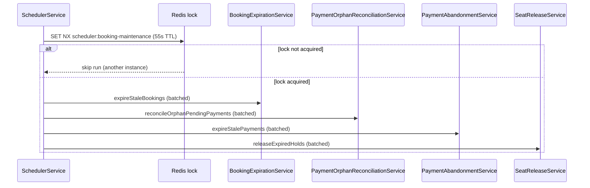

# Scheduler module

Cron orchestration for booking maintenance and FX rate refresh. Business rules live in downstream services — the scheduler only wires order, locking, and error isolation.

## Cron jobs

| Job | Interval | Service | Purpose |
|-----|----------|---------|---------|
| `runBookingMaintenance` | every minute | `SchedulerService` | Expire bookings, reconcile orphan payments, abandon stale PSP sessions, resync expired seat holds |
| `refreshFxRates` | every hour | `FxRatesSchedulerService` | Refresh Frankfurter FX rates into Redis + in-memory cache |
| Outbox dispatch | every 5 seconds | `OutboxProcessor` (`infra/outbox`) | Not part of this module, but uses the same `ScheduleModule.forRoot()` in `AppModule` |

## Booking maintenance pipeline

Order is intentional — do not reorder without understanding seat/hold semantics.

### Step details

1. **Expire bookings** — `PNR_CREATED` / `SEATS_SELECTED` past `expiresAt` → `EXPIRED`, release seats/inventory, cancel abandonable transactions, Kafka `booking.expired` via outbox. Multi-batch cap: 10k/run.
2. **Reconcile orphan pending** — `PENDING` transactions with `externalId = null` older than 2 minutes: recover `pendingProviderSessionId` from `providerMeta`, or rollback via `PaymentPendingRollbackService`. Multi-batch cap: 5k/run.
3. **Abandon stale payments** — `PAYMENT_PENDING` bookings past `paymentExpiresAt` → local cancel + provider best-effort cancel. Multi-batch cap: 10k/run.
4. **Release expired holds** — holds with `expiresAt < now`: skip fully expired bookings (step 1 handles them); for active bookings resync hold TTL to booking `expiresAt`. Batched (500 holds × 20 batches max).

Hold release runs **after** expiration so active bookings get TTL resync, not premature seat release.

## Multi-instance

- **Redis distributed lock** (`SchedulerLockService`): only one instance runs `runBookingMaintenance` per minute (`SET NX`, TTL 55s).
- Lock miss → debug log, pipeline skipped (no error).
- Duplicate backend processes on one DB still waste work on FX cron and outbox — see README warning about running two servers on `:3001`.

## Error handling

Each pipeline step runs in `runMaintenanceStep`:

- Failure in one step **does not block** later steps.
- Failed step → `logger.error` + `SchedulerMetricsService.recordMaintenancePipelineStepFailed(step)`.
- Metric: `maxairline_scheduler_maintenance_pipeline_step_failed_total{step=...}`.

FX refresh (`FxRatesSchedulerService`) uses its own try/catch — isolated from booking maintenance.

## Module boundaries

| Import | Why |
|--------|-----|
| `BookingExpirationModule` | TTL expiration |
| `PaymentOrphanReconciliationModule` | Orphan PSP session reconciliation (not full `PaymentsModule`) |
| `PaymentAbandonmentModule` | Stale payment abandonment |
| `SeatReleaseModule` | Hold TTL resync |
| `FlightsModule` | `CurrencyRatesService` for FX cron only |
| `RedisModule` | Maintenance lock |

`PaymentPendingRollbackService` is shared between `PaymentService` (checkout rollback) and orphan reconciliation.

## Testing

| Layer | Coverage |
|-------|----------|
| Unit | `scheduler.service.spec` — order, lock skip, per-step failure isolation |
| Unit | `fx-rates-scheduler.service.spec` |
| Unit | Downstream maintenance services (expiration, abandon, orphan, seat release) |

No dedicated scheduler e2e — behavior validated via service unit tests and booking/payment integration tests.

## Related docs

- [payment.md](./payment.md) — orphan reconcile, abandonment, webhook-first flow
- [ticketing.md](./ticketing.md) — async issuance after `booking.paid` outbox
