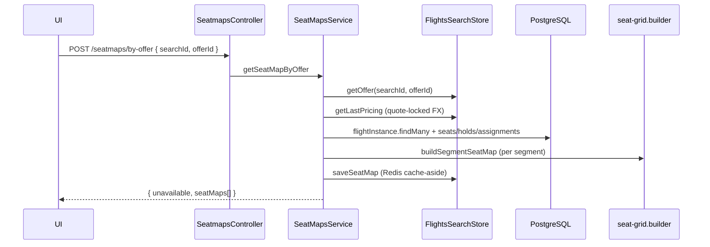

# Seatmaps module

Seat map API for the booking flow: load cabin layout, seat availability per segment, and seat surcharges in the search currency.

## Flow



### Downstream consumers

| Consumer | Usage |
|----------|--------|
| **Booking creation** | `getSeatMapByOffer` → `seatSelectionRequired` in snapshot |
| **Booking checkout** | cache `getSeatMap` first, fallback `getSeatMapByOffer` |
| **Flights `CalculateSeatPrice`** | `resolveSeatPriceInCurrency` from shared catalog |
| **Admin flights** | `computeSeatPriceInCurrency` when seeding seat rows |

## Pricing

Seat **surcharges** (not base fare) live in `src/shared/pricing/seat-fee.catalog.ts`:

- Catalog defined in **USD** (window/aisle/middle + premium/exit/extra legroom).
- `resolveSeatPriceInCurrency` ignores stored DB `price` magnitudes — derives from attributes (legacy-safe).
- When pricing quote exists, seatmap uses **the same `fxRates`** as checkout (`getLastPricing`).

Row attributes for seeds (`isPremium` rows 1–3, exit row 11, etc.) use `deriveSeatAttributesFromRow` from the same catalog module.

## Availability rules

Per segment (`segmentId` from search offer):

1. `FlightSeat.status === AVAILABLE`
2. No active `SeatHold` for this segment (`expiresAt > now`)
3. No `SeatAssignment` for this segment

Implemented in `domain/seat-availability.policy.ts`. DB query filters holds/assignments by **offer segment ids** (not all segments on the instance).

## Multi-segment offers

- Each segment with a configured `flightInstanceId` gets its own `seatMaps[]` entry.
- If one instance has **no seats**, that segment is **skipped** (others still returned).
- `unavailable: true` only when **no** segment produced a seat map (no instances or all empty).

## Stale read disclaimer

The seat map is a **point-in-time snapshot**:

- Holds expire; another user can take a seat between map view and checkout.
- Checkout / `CalculateSeatPrice` re-validates availability and holds at selection time.
- Cached seatmap in Redis (TTL aligned with search) may lag live DB by a few seconds.

This is normal for airline retail; final authority is checkout + hold/booking transaction, not the map API.

## Module layout

```
seatmaps/
  controllers/seatmap.controller.ts   # POST by-offer (read + cache write)
  services/
    seatmap.service.ts              # orchestration, DB load, cache
    seat-grid.builder.ts            # grid assembly, facilities, cabin, prices
  domain/
    seat-availability.policy.ts
  dtos/seatmap.dto.ts

shared/pricing/
  seat-fee.catalog.ts               # cross-module seat surcharge catalog
```

## Tests

- Unit: `seatmap.service.spec.ts`, `seat-fee.catalog.spec.ts`, `seat-grid` via service tests
- E2E: `seatmaps.e2e-spec.ts` — search → authenticated seatmap

## Related

- `bookings/utils/seatmap-availability.util.ts` — `seatSelectionRequired` from map payload
- `flights/services/flights-cache.service.ts` — offer, pricing, seatmap Redis keys
