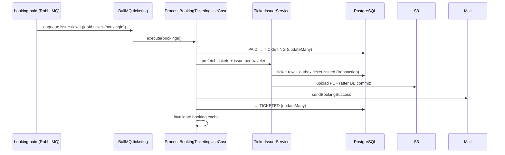

# Ticketing module

Async issuance of e-tickets after payment: PDF generation, S3 storage, DB records, Kafka events, success email, and compensation on failure.

## Happy path



Entry points:

| Trigger | Path |
|---------|------|
| Payment success | outbox `booking.paid` → Rabbit consumer → `TicketingEnqueueService` |
| Admin / manual | `TicketingService.issueTicket(bookingId)` |

## Per-traveler issuance (`TicketIssuerService`)

1. **Prefetch** all tickets for `bookingId` (one query).
2. For each traveler:
   - If ticket exists → regenerate PDF and **re-upload** to S3 (retry-safe).
   - Else → `TicketPersistenceService.recordIssuedTicket` (DB + Kafka outbox `ticket.issued`) **then** `TicketDocumentService.uploadPdf`.

### S3 vs DB ordering (trade-off)

- **DB first, S3 after commit** — no orphan PDFs in S3 without a ticket row.
- If S3 fails after DB, retry finds the ticket row and only re-uploads PDF.
- Orphan DB without S3 is recoverable; orphan S3 without DB is avoided.

## Mail vs `TICKETED` status

Success email is sent **before** `updateMany` to `TICKETED`.

If mail fails, booking stays `TICKETING`; BullMQ retries re-run issuance (idempotent tickets) and can send mail again.

Previously mail ran after `TICKETED`, so a mail failure on retry skipped email entirely.

## Failure handling

| Error type | Behavior |
|------------|----------|
| `TicketingUnrecoverableError` | No BullMQ retry; `TicketingFailureHandler` escalates immediately |
| Recoverable (PDF/S3/network) | BullMQ retries (max 5, exponential backoff) |
| Retries exhausted | `onFailed` → escalate with `RETRIES_EXHAUSTED` |

### Escalation (`escalateTicketingFailure`)

In one transaction:

1. Outbox INTERNAL `booking.ticketing.failed` → `TicketingFailedOutboxHandler`
2. Outbox Kafka `booking.ticketing.failed`
3. Booking `updateMany` → `FAILED` (from `PAID` / `TICKETING`)

Handler calls `PaymentAbandonmentService.compensateTicketingFailure`:

- Refund at PSP when payment succeeded (with idempotency flags in `providerMeta`)
- Release seats / inventory in transaction
- User gets failure email (best effort)

## Idempotency

| Layer | Mechanism |
|-------|-----------|
| BullMQ job | `jobId: ticket-{bookingId}` |
| Ticket row | `@@unique([bookingId, travelerId])` + early return / prefetch |
| Compensation | `ticketingCompensationRecorded`, `ticketingRefundCompleted` in payment meta |

## Module layout

```
ticketing/
  use-cases/process-booking-ticketing.use-case.ts   # orchestration
  services/
    ticket-issuer.service.ts          # per-traveler flow
    ticket-document.service.ts        # PDF + S3
    ticket-persistence.service.ts     # DB + outbox
    ticketing-failure.handler.ts      # escalate + notify
    ticketing-enqueue.service.ts      # BullMQ
  handlers/ticketing-failed.outbox-handler.ts
  ticketing.processor.ts              # thin BullMQ adapter
  domain/ticketing-booking.policy.ts
```

## Tests

- Unit: use case, issuer, failure handler, escalation util
- Integration: `test/integration/booking-ticketing.integration-spec.ts`

## Related

- `payment` — `compensateTicketingFailure`, refund ordering
- `infra/rabbitmq/booking-events.consumer.ts` — consumes `booking.paid`
- `infra/outbox` — relays `ticket.issued` and failure events
