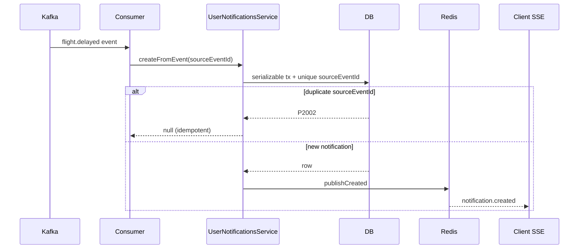

# Users module

Profile, settings, saved passengers, and in-app notifications — including concurrency rules and realtime delivery.

## Layout

| Area | Service | HTTP |
|------|---------|------|
| Profile / settings | `UsersService` | `GET/PATCH users/me`, `GET/PATCH users/me/settings` |
| Saved passengers | `SavedPassengersService` | `GET/POST users/me/passengers`, `POST users/me/passengers/sync` |
| Notifications | `UserNotificationsService` | `GET users/me/notifications`, SSE `stream`, mark read |

`SavedPassengerMapper` holds domain rules (normalization, passport completeness, infant rules) without I/O.

`admin-users/` is a separate module for staff user management — not part of this surface.

## Profile and settings

### Reads

- `getPublicProfile` — full public profile via `userPublicSelect` (no password).
- `getSettings` — country, citizenship, city, currency only.
- `getById` — minimal auth slice for `AuthModule` (returns `null` if missing; caller decides).

### `updateProfile`

1. Inside a DB transaction:
   - If `dto.email` is present, load current email and detect change.
   - `user.update` with profile fields; when email changes, set `emailVerifiedAt: null`.
2. **After commit:** if email changed and new email is set, `EmailVerificationService.sendForUserSafe` (external mail — not inside the transaction).
3. `P2002` → `ConflictException` (duplicate email); `P2025` → `NotFoundException`.

Email verification is intentionally **post-commit**: a failed send leaves the user with an unverified email in DB, which is correct for retry.

### `updateSettings`

Partial update of locale-related preferences (`country`, `citizenship`, `city`, `currency`).

### Auth coupling

`UsersModule` uses `forwardRef(AuthModule)` for `EmailVerificationService` after profile email change. Locale defaults for registration live in `src/shared/locale/locale-defaults.util.ts` (used by `AuthService`, not re-exported through users).

## Saved passengers

### Identity and limits

- Unique key: `(userId, passportNumber)`.
- Cap: `MAX_SAVED_PASSENGERS = MAX_PASSENGERS_PER_BOOKING * 5`.
- Optional `isPrimary` — at most one primary per user.

### Concurrency (Serializable)

`runSerializableTransaction` wraps:

| Operation | Why Serializable |
|-----------|------------------|
| `createForUser` | Duplicate passport check + primary clear + insert must not interleave |
| `setPrimary` | Clear other primaries + set one primary |
| `upsertFromBookingTravelers` | Batch sync with limit check across many inserts |

On unique violation after a race: `P2002` on passport → `ConflictException`. Serialization failure: `P2034` with retry (max 2).

### Sync API

`POST passengers/sync` replaces the user's saved list from checkout travelers:

1. Normalize and validate batch passport uniqueness.
2. In one transaction: prefetch existing by passport numbers, upsert each traveler, enforce limit for **new** passports only.
3. Returns fresh `listForUser` after commit.

Infants without passport are skipped (`canPersist`); mapper enforces adult/child passport rules.

## Notifications

### Sources

| Path | Idempotency |
|------|-------------|
| `create` (internal) | Upsert unread duplicate per `(userId, bookingId, type)` when `readAt` is null |
| `createFromEvent` (Kafka) | Unique `sourceEventId` — duplicate event returns `null` |
| Booking notifications service | Calls `UserNotificationsService` after Kafka consume |

### Ownership

Notifications with `bookingId` require `assertBookingOwnership` — booking must belong to `userId`.

### Unread upsert (Serializable)

Concurrent flight-delay events for the same booking:

1. Find unread with same `bookingId` + `type`.
2. If found → update title/message/`createdAt` (bump to top).
3. Else → create.

Serializable isolation prevents two concurrent creates both passing the “no unread duplicate” check.

### Mark read

- `markRead` — `updateMany({ id, userId, readAt: null })` then load; `count === 0` → already read or not found.
- `markAllRead` — `updateMany` for all unread for user.

### Realtime (SSE)

- **Write path:** after DB persist, `NotificationRealtimeService.publishCreated` (Redis pub/sub).
- **Read path:** `UserNotificationsService.streamForUser` — controller does not touch Redis directly.

Client: `GET users/me/notifications/stream` (SSE). Heartbeat + `notification.created` events.

## Sequence: Kafka notification → SSE

## Testing

| Layer | Coverage |
|-------|----------|
| Unit | `UsersService`, `SavedPassengersService`, `UserNotificationsService`, `SavedPassengerMapper`, locale defaults |
| E2E | `users.e2e-spec.ts` — profile, settings, passengers, notifications |

## Related modules

- `auth/` — registration, JWT, email verification tokens
- `bookings/` — `BookingNotificationsService` creates user notifications from booking events
- `infra/notifications/` — Redis SSE transport (`NotificationRealtimeService`)
